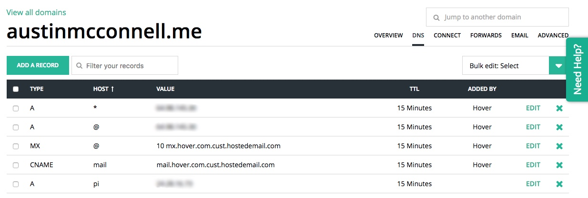
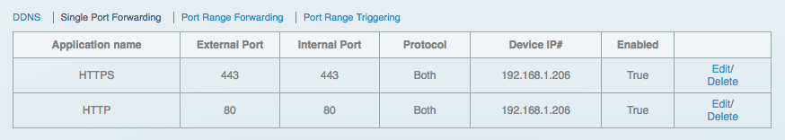

# Raspberry Pi Media Server

This installation is build on top of [Hypriot OS](https://hypriot.com/) which has Docker pre-installed. Where applicable, it's built with the assumption that Macs will be used to connect/interface with the raspberry pi (e.g. choice of network mount)

The following applications are run using Docker:

- LetsEncrypt
- Plex
- Tautulli
- Nextcloud
- Home Assistant
- Portainer

## Flash OS to SD Card

### Install Flash tool
Follow the installation instructions [here](https://github.com/hypriot/flash#installation) to install the Flash tool.

### Download user-data.yml file

Download this file: https://github.com/austinmcconnell/raspberry-media-server/blob/master/user-data.yml.sample

Rename it from user-data.yml.sample to user-data.yml

Edit the file and change the password for the pirate user.

Optionally, add an authorized ssh key by adding this line to the user block

ssh_authorized_keys:
  - ssh-rsa AAA...ZZZ (replace with your public key. If you don't know what a public key is, skip this part)

**Note: SD card should be formatted as exfat**

Format your sd card as exfat with a Master Boot Record with the following command:

```bash
diskutil eraseDisk exfat name MBRFormat /dev/diskN
```

Flash HypriotOS to your SD card by running the following command:

```bash
flash --userdata /path/to/user-data.yml https://github.com/hypriot/image-builder-rpi/releases/download/v1.9.0/hypriotos-rpi-v1.9.0.img.zip
```

If you get the error `dd: invalid number: ‘1m’` while flashing your sd card, check which version of `dd` you are using with `which dd`. If the result is, `/usr/local/opt/coreutils/libexec/gnubin/dd`, then you likely have installed `coreutils` with brew which has it's own version of dd. Uninstall `coreutils` and try the flash command again.

Insert the SD card into the raspberry pi, plug in ethernet and hdmi cables, and power up the raspbery pi. It'll take at least 5 minutes to updated all the packages.

## SSH into Server

```bash
ssh pirate@black-pearl.local
```

If you didn't change the password earlier, the default password is `hypriot`. **CHANGE IT**. Simply type the following command and you'll be able to change your password

```bash
$ passwd
```

## Create config directories

### Create appdata directory

Create appdata directory

```bash
$ cd /opt
$ sudo mkdir appdata
```

By default it will be owned by the root user.

```bash
HypriotOS/armv7: pirate@black-pearl in /opt
$ ls -l
total 8
drwxr-xr-x 2 root root 4096 Jun  6 01:31 appdata
drwxr-xr-x 5 root root 4096 Apr 28 18:55 vc
```

Change ownership to the pirate user.

```bash
$ sudo chown pirate:pirate appdata/
```

Voila

```bash
$ ls -l
total 8
drwxr-xr-x 2 pirate pirate 4096 Jun  6 01:31 appdata
drwxr-xr-x 5 root   root   4096 Apr 28 18:55 vc
```

### Create application directories

`cd` to `appdata/` directory and make individual application directories

```bash
$ cd appdata/
$ mkdir letsencrypt plex tautulli nextcloud home-assistant portainer
```

## Mount A Network Disk

An external drive is necessary to store
 - movies and tv shows for Plex
 - nextcloud synced files

Instructions adapted from [this](https://medium.com/@aallan/adding-an-external-disk-to-a-raspberry-pi-and-sharing-it-over-the-network-5b321efce86a) article

### Format the Disk

Go ahead and plug in your external drive, and type the following.

```bash
$ sudo apt-get install dosfstools
```

List all drives

```
$ sudo blkid -o list
device                fs_type     label            mount point      UUID
--------------------------------------------------------------------------------------------------------
/dev/mmcblk0                                       (in use)
/dev/mmcblk0p1        vfat        HypriotOS        /boot            7075-EEF7
/dev/mmcblk0p2        ext4        root             /                2a81f25a-2ca2-4520-a1a6-c9dd75527c3c
/dev/sda1             ext4        nextcloud        /mnt/nextcloud   7f68d8da-98bc-4553-9ce7-6b0df574ec15
/dev/sda2             ext4        plex             /mnt/plex        98b43986-eaa4-4bcc-9618-ac04d1652476
```

Format drive (if needed)

```bash
$ sudo mkfs.ext4 /dev/sdaN -n USB
```

Or for cross-platform compatibility

```bash
$ sudo mkfs.fat32 /dev/sdaN -n USB
```

Although be aware that if the disk is already formatted it might automatically be mounted by (more recent) versions of Raspbian, and you might have to unmount it before formatting.

```bash
$ sudo umount /dev/sdaN
```

If you need to rename the filesystem labels, you can use the following command.

```bash
$ sudo e2label {device} {label}
```

### Mounting the Disk

For all commands below, I'll used /dev/sdaN to be general. Replace N with the correct partition number for each partition.

```bash
$ sudo mkdir /mnt/plex
$ sudo mkdir /mnt/nextcloud
$ sudo mkdir /mnt/postgres
$ sudo chown -R pirate:pirate /mnt/plex
$ sudo chown -R pirate:pirate /mnt/nextcloud
$ sudo chown -R pirate:pirate /mnt/postgres
```

For FAT32 formatted drives, manually mount with the following command

```bash
$ sudo mount /dev/sdaN /mnt/plex -o uid=pirate,gid=pirate
$ sudo mount /dev/sdaN /mnt/nextcloud -o uid=pirate,gid=pirate
$ sudo mount /dev/sdaN /mnt/postgres -o uid=pirate,gid=pirate
```

For ext formatted drives, the user and group are determined by the folder permissions so they must be drop from any mount commmands.

```bash
$ sudo mount /dev/sdaN /mnt/plex
$ sudo mount /dev/sdaN /mnt/nextcloud
$ sudo mount /dev/sdaN /mnt/postgres
```

If you want it to automatically mount on boot you’ll need to append the following to the /etc/fstab file,

```bash
$ sudo nano /etc/fstab
```

Add the following lines for FAT32

```
/dev/sdaN /mnt/plex auto defaults,user,nofail,uid=1000,gid=1000 0 2
/dev/sdaN /mnt/nextcloud auto defaults,user,nofail,uid=1000,gid=1000 0 2
/dev/sdaN /mnt/postgres auto defaults,user,nofail,uid=1000,gid=1000 0 2
```

And for ext

```
/dev/sdaN /mnt/plex auto defaults,user,nofail 0 2
/dev/sdaN /mnt/nextcloud auto defaults,user,nofail 0 2
/dev/sdaN /mnt/postgres auto defaults,user,nofail 0 2
```

You can now leave the disk plugged into your Raspberry Pi and it’ll automatically mount when the board is rebooted. However right now the disk isn’t visible from the network, so let’s go ahead and change that.

### Making the Disk Available Using AFS (For Accessing via Macs)

Simply install the Netatalk package on your Raspberry Pi.

```bash
$ sudo apt-get install netatalk
```

Edit the /etc/netatalk/AppleVolumes.default. Add the /mnt/usb disk to the list of exported file systems. The easiest way to do this is just to append it near the bottom after the entry for `~/`.

```bash
$ sudo nano /etc/netatalk/AppleVolumes.default
```

Page to the end of the file (control + v) and you will see users have access to their home directory by default.

```bash
~/                      "Home Directory"
```

Add the following lines below ~/. Also, I renamed "Home Directory" to "home" because I like naming conventions to be consistent. Feel free to name the mount points whatever you like. The names will show up as folder names in Finder when you mount the drive.

```bash
~/                      "home"
/mnt/plex               "plex"
/mnt/nextcloud          "nextcloud"
```

If you want to you can also remove the entire line for `~/` which will mean that the only disk exported is our external drive. Afterwards go ahead and restart the Netatalk daemon.

```bash
$ sudo /etc/init.d/netatalk restart
```
You should now be exporting the drive via AFS.

### Mounting the Disk from your Mac
Going to your Mac your Raspberry Pi should now show up in the left-hand panel of the Finder. Click on it, and then the ‘Connect As…’ button.


## Clone repository

In your home folder, clone this repository.

```bash
$ git clone https://github.com/austinmcconnell/raspberry-media-server
```

### Docker-compose aliases

Add the following line to `~/.bash_profile`

```
source ~/raspberry-media-server/.alias
```

to use the aliases listed in [this](.alias) file.

## Domain Forwarding

### Forward (sub)domain

If you don't already have a domain name (or have a new one in mind), I recommend [Hover](https://hover.com/nTDq8IDa) for all domain name needs. They offer free privacy on all their domain names which protects your information (name, address, etc)

Access the DNS record of the domain you wish to forward. For Hover, that's Account -> Domains -> (select domain to edit) -> DNS. You'll see something like this.



Create an A record pointing to your public ip address for each of the following hostnames:

- pi
- nextcloud
- plex
- homeassistant
- tautulli
- portainer
- photos

If you want your main domain (e.g. `austinmcconnell.me`) to forward to your media sever, then change the values for the A records with Host type `*` and `@` as well.

For help finding your public IP address, [this](https://www.whatismyip.com/) is a helpful website. You'll want the IPv4 address.


### Forward ports from router to Raspberry Pi

This part is highly specific to your individual router. Google around for instructions/tutorials for your specific router's make and model.

You're looking for something like this.



Forward both ports `80` and `443` to your Raspberry Pi.

## Set Environment Variables

### Generic Environment Variables

Create a .env file in the same directory as your docker-compose.yml file

```bash
$ nano general.env
```

Add the following environment variables

```ini
EMAIL=$your_email$
URL=$main_domain$  # eg: austinmcconnell.me
```

### Database-Specific Environment Variables

Create a db.env file in the same directory as your docker-compose.yml file

```bash
$ nano db.env
```

Add the following environment variables

```ini
POSTGRES_USER=nextcloud
POSTGRES_PASSWORD=$replace_me!$
POSTGRES_DB=nextcloud
```

## Start containers
Start all docker containers in the docker compose file.

```bash
$ dc up -d
```

This will take a couple of minutes while docker downloads and extracts all the images and layers.

To view the logs, type

```bash
$ dclogs
```

## Configure Applications

### NGINX Setup

#### Set client_max_body_size to unlimited in nginx/proxy.conf
 in nginx/proxy.conf

```bash
cd /opt/appdata/letsencrypt/nginx
nano proxy.conf
```
Change line from `client_max_body_size 10m;` to `client_max_body_size 0;`

#### Add fastcgi_read_timeout in nginx/site-confs/default

```bash
cd /opt/appdata/letsencrypt/nginx/site-confs
nano default
```
Add `fastcgi_read_timeout 1200;` in the `location ~ \.php$` block of the main server block

#### Forward all traffic to HTTPS

Uncomment the following block in nginx/site-confs/default

```ini
server {
        listen 80;
        listen [::]:80;
        server_name _;
        return 301 https://$host$request_uri;
}
```

### Plex Setup

TODO: Fill in!

### Tautulli Setup

Go through the welcome screens to configure. You might have to access via your local network (eg. 192.168.1.XXX:8181). Mostly, just enter your plex username and password and pick which plex server you want to track.

#### Enable reverse proxy

Settings -> Web Interface -> Show Advanced

Check the boxes for `Enable HTTP Proxy` and `Enable HTTPS`.

Enable the provided tautulli sample conf file.

```bash
$ cd /opt/appdata/letsencrypt/nginx/proxy-confs
$ mv tautulli.subfolder.conf.sample tautulli.subfolder.conf
```

### Nextcloud setup

### Setup reverse proxy

Enable the provided nextcloud sample conf file.

```bash
$ cd /opt/appdata/letsencrypt/nginx/proxy-confs
$ mv nextcoud.subdomain.conf.sample nextcloud.subdomain.conf
```

I had to change the proxy_max_temp_file_size to 1024m. I believe this is Raspberry Pi 2 specific. Try with default setting on a Raspberry Pi 3.

From

```ini
proxy_max_temp_file_size 2048m;
```

to

```ini
proxy_max_temp_file_size 1024m;
```

#### Edit nextcloud config.php

Edit the nextcloud config file at `/opt/appdata/nextcloud/www/nextcloud/config/config.php`.

Add this line to the trusted_domains array

```
    1 => 'nextcloud.austinmcconnell.me',
```

Add the following lines to the top-level config array

```ini
'overwrite.cli.url' => 'https://nextcloud.austinmcconnell.me',
'overwritehost' => 'nextcloud.austinmcconnell.me',
'overwriteprotocol' => 'https',
```

#### Security check

To check the security of your private nextcloud server, visit [scan.nextcloud.com](scan.nextcloud.com).

#### Theme

I'm using the [nextcloud-breeze-dark]() theme. Clone it to the themes folder with the following command:

```bash
git clone https://github.com/mwalbeck/nextcloud-breeze-dark /opt/appdata/nextcloud/www/nextcloud/themes/nextcloud-breeze-dark
```

To enable the theme, add or change the theme option in your config.php to:

```ini
'theme' => 'nextcloud-breeze-dark',
```

## Backup your AppData and Home folder

We'll use [rclone](https://rclone.org) which is "rsync for cloud storage".

To install rclone on Linux/macOS/BSD systems, run:

```bash
curl https://rclone.org/install.sh | sudo bash
```

Depending on your OS, you might have to install unzip First.

```bash
sudo apt-get install unzip
```

Setup rclone using the following command

```bash
 rclone config
```

Set up remote backups for the /opt/appdata and ~/raspberry-media-server folder like so.

### Plex

For Plex, we need to [backup](https://support.plex.tv/articles/201539237-backing-up-plex-media-server-data/) the data and additional settings. This section is for backing up application config so all we need is the Preferences.xml file
```bash
rclone copy /opt/appdata/plex/Library/Application\ Support/Plex\ Media\ Server/Preferences.xml remote:raspberry-pi-backup/appdata/plex/ --progress
```

### Nextcloud

For nextcloud, the two main folders we need to backup are config and themes

```bash
rclone copy /opt/appdata/nextcloud/www/nextcloud/config remote:raspberry-pi-backup/appdata/nextcloud/config --progress
rclone copy /opt/appdata/nextcloud/www/nextcloud/themes remote:raspberry-pi-backup/appdata/nextcloud/themes --progress
```
Backup the data
TODO

Backup the database
TODO

### Letsencrypt

It's only 5 MB. Just copy it all!

```bash
rclone copy /opt/appdata/letsencrypt remote:raspberry-pi-backup/appdata/letsencrypt --copy-links --progress
```

### Home Assistant

Make a file `exclude-file.txt` with the following contents:

```ini
*.db
.git/
.uuid
```

Backup everything except files matching patterns in the exclude file

```bash
rclone copy /opt/appdata/home-assistant remote:raspberry-pi-backup/appdata/homeassistant --exclude-from exclude-file.txt --progress
```

### Tautulli

```bash
rclone copy /opt/appdata/tautulli remote:raspberry-pi-backup/appdata/tautulli --exclude logs --progress
```

### Cron

Add the included rclone-cron.sh to the pirate user's crontab.

```bash
crontab -e
```

Add the following line to the bottom of the file
```
0 2 * * * ~/raspberry-media-server/rclone-cron.sh >/dev/null 2>&1
```

All the rclone backups will occur each morning at 2:00 AM.

## Picocluster (Advanced)

If you want to set this up on a Picocluster (I used the [Pico 3](https://www.picocluster.com/collections/pico-3/products/pico-3-raspberry-pi)), follow these steps.

First, flash the master (`user-data-master.yml`) and worker user-data files (`user-data-workerN.yml`).

If you are prividing ssh-authorized-keys and want to disable password login, change `lock_passwd` from `false` to `true` in the user-data files.

SSH into the master to get the join token

```bash
ssh pirate@pc0.local
docker swarm join-token worker
```

Copy the output of the previous command. SSH into the first worker and run join the swarm.

```bash
ssh pirate@pc1.local
docker swarm join --token $token_from_previous_step$ 192.168.1.240:2377
```

Repeat the above for workers 2 and 3
